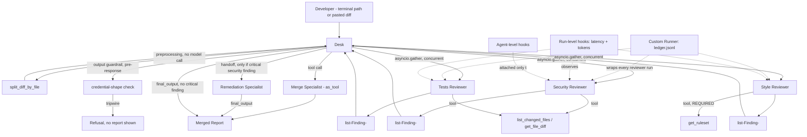
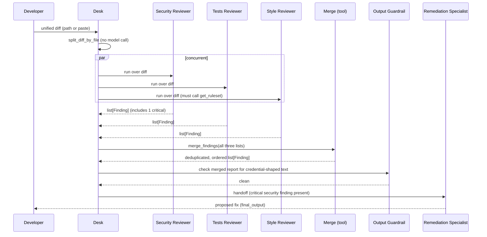

# Plan — Code Review Desk

**Version:** 1.0.0
**Governs:** Architecture and technical design. Every decision here MUST satisfy every requirement
in `spec.md` without violating any article of `constitution.md`.

---

## 1. Architecture Overview



## 2. Agents

| Agent | Role | Model | Instructions | Output type | Handoff targets |
|---|---|---|---|---|---|
| **Desk** | Entry point: splits diff, launches reviewers concurrently, calls Merge, decides on Remediation | `gemini-3.6-flash` (see constitution.md Article I.1 note), moderate temperature (e.g. 0.3) | Static — the Desk's job is orchestration, not per-turn personalization | `Report` | Remediation Specialist |
| **Base Reviewer** | Not exposed; exists only to be cloned | `gemini-3.6-flash`, baseline settings | Generic placeholder, always overridden | `list[Finding]` | none |
| **Security Reviewer** | Vulnerabilities, unsafe patterns, credential-shaped strings in the diff | Cloned from Base; low temperature (e.g. 0.1) for precision | Built per-run from `ReviewContext` (FR-4); focuses on security-relevant patterns | `list[Finding]` | none (leaf) |
| **Tests Reviewer** | Missing/weakened test coverage implied by the diff | Cloned from Base; moderate temperature (e.g. 0.2) | Built per-run from `ReviewContext` | `list[Finding]` | none (leaf) |
| **Style Reviewer** | Ruleset violations — naming, formatting, structure | Cloned from Base; low temperature (e.g. 0.1) for consistency | Built per-run from `ReviewContext`; terser when `strictness == "strict"` | `list[Finding]` | none (leaf) |
| **Merge Specialist** | Deduplicates and orders findings by severity | `gemini-3.6-flash`, low temperature | Single-purpose: merge, dedupe, order — never adds new findings | plain structured data (not a handoff target — a tool) | — |
| **Remediation Specialist** | Proposes a fix for a critical security finding | `gemini-3.6-flash`, moderate temperature | Receives the critical finding(s); proposes a patch, never applies it (NG-2) | text/patch proposal | none (leaf) |

**Design decision — why Merge is a tool and Remediation is a handoff (spec.md §4.6's required
justification, restated here for the architecture record).** Merge's output is consumed and
re-presented by the Desk in the Desk's own voice — the Desk remains the speaker, so Merge is a
callable capability (`.as_tool(...)`). Remediation's proposal should reach the user in the
Remediation Specialist's own voice and judgment once a critical issue is confirmed — authorship of
the reply transfers, so it is a handoff.

## 3. Tools / Capabilities

| Name | Owner agent(s) | Parameters (model-supplied) | Context read internally | Returns | Failure behavior |
|---|---|---|---|---|---|
| `split_diff_by_file` | Desk (preprocessing, not exposed to any agent as a callable tool) | — | — | list of per-file diff chunks | Empty/malformed diff → returns an empty list with a reported reason; never raises |
| `list_changed_files` | Security, Tests, Style | none | no | list of file paths touched in the diff | Returns empty list if the diff produced no chunks |
| `get_file_diff` | Security, Tests, Style | `file_path: str` | no | that file's diff chunk text | Returns a not-found string if the path isn't among the split chunks |
| `get_ruleset` | Style (**required** — see §9 below), Security, Tests (optional for these two) | none | **yes** — reads `context.ruleset_id` | ruleset text | Returns "ruleset unavailable" string if the file is missing/unreadable — never raises |
| `merge_findings` (via Merge-as-tool) | Desk | the three reviewers' `list[Finding]` results | no | one deduplicated, severity-ordered `list[Finding]` | Returns the union unmodified (no dedup applied) with a note if the merge logic itself errors, rather than raising |

`get_ruleset` satisfies FR-2's acceptance criterion: its generated schema has **zero parameters**,
since `ruleset_id` comes from the run context, never from the model.

## 4. Data Structures

### 4.1 `ReviewContext` (local run context)

```python
from dataclasses import dataclass

@dataclass
class ReviewContext:
    repo: str
    language: str
    ruleset_id: str
    strictness: str = "normal"   # "normal" | "strict" — validated in __post_init__

    def __post_init__(self) -> None:
        if self.strictness not in ("normal", "strict"):
            raise ValueError(f"Invalid strictness: {self.strictness!r}")
```

### 4.2 `Finding` (structured reviewer output)

```python
from typing import Literal
from pydantic import BaseModel, Field

class Finding(BaseModel):
    file: str
    line: int
    severity: Literal["critical", "major", "minor"]
    message: str = Field(min_length=1)
```

Each reviewer's `output_type` is `list[Finding]`. Per the brief's own note: the SDK wraps a list
root in a single-key object because strict JSON schemas must be objects — inspect the generated
schema to see this wrapper, but `final_output` at runtime is a plain Python `list[Finding]`, never
the wrapper object itself. This distinction is FR-3's second acceptance criterion.

### 4.3 `Report` (the Desk's own output type, implied by FR-6/FR-10)

```python
class ReviewerFooterRow(BaseModel):
    reviewer: str
    ms: int
    tokens: int
    partial: bool = False   # true if this reviewer hit its ceiling or failed

class Report(BaseModel):
    findings: list[Finding]
    footer: list[ReviewerFooterRow]
    remediation_proposed: bool
```

### 4.4 Ledger line shape (`ledger.jsonl`, FR-11)

```json
{"ts": "2026-09-23T19:04:11Z", "request_id": "rev_8f21", "agent": "SecurityReviewer", "ms": 2140, "findings": 3}
```
One line per **reviewer run** (not per file, not per whole review) — a three-reviewer review
produces three lines.

## 5. Concurrency Design (FR-5)

The Desk launches all three reviewers with a single concurrent-gather call over the same diff
input, e.g.:

```python
results = await asyncio.gather(
    Runner.run(security_reviewer, diff_text, context=review_context, max_turns=REVIEWER_MAX_TURNS),
    Runner.run(tests_reviewer, diff_text, context=review_context, max_turns=REVIEWER_MAX_TURNS),
    Runner.run(style_reviewer, diff_text, context=review_context, max_turns=REVIEWER_MAX_TURNS),
    return_exceptions=True,  # one reviewer's failure must not cancel the others (spec.md §4.5)
)
```

`return_exceptions=True` is load-bearing: without it, one reviewer's exception would cancel the
`gather` and take down the other two in-flight reviewers, violating spec.md §4.5's isolation
requirement. Each result is checked individually afterward; a failed reviewer contributes an empty
finding list and a `partial=True` footer row rather than aborting the review.

**Demonstrating concurrency (FR-5's acceptance criterion):** the Desk records `time.monotonic()`
immediately before and after the `gather` call for the group's wall-clock time, and each
`Runner.run()` call is separately timed inside the hooks (FR-10) for the "sum of three" comparison.
Both numbers are shown together in the demo.

## 6. Guardrail Design (FR-8 — output side)

Unlike a typical input guardrail, this one runs on the **Desk's finished report**, after Merge (and
Remediation, if triggered) but before anything is shown to the user. It inspects every finding's
`message` field and the remediation proposal's text for patterns shaped like credentials — API key
formats, bearer tokens, password-looking assignments with real-looking values copied verbatim from
the diff. On a match, it raises the guardrail tripwire.

The tripwire is caught at exactly one place: the top-level entry point (both the terminal path and
the Chainlit handler). On catch, a fixed refusal message is shown instead of the report — the
report itself is discarded, never partially shown (Article II.4).

**Avoiding false positives (spec.md §4.8's edge case):** the check targets value shapes (e.g. a
long, high-entropy string, a `key = "..."` pattern with plausible token structure), not the mere
presence of words like "password" or "secret" in ordinary code discussing them.

## 7. Hooks Design (FR-10)

- **Run-level hooks** are registered once per reviewer run and record: start time, end time,
  elapsed ms, and token usage (from the run's usage data in context) — for every one of the three
  reviewers. This produces the three footer rows.
- **Agent-level hooks** are attached only to the **Security Reviewer** (Design decision, spec.md
  §4.10) — the reviewer whose process carries the highest cost if unexamined. They fire only while
  Security is executing and produce nothing during the other two reviewers' runs — expected, not a
  bug.

## 8. Custom Runner / Ledger Design (FR-11 — cut-list priority 1)

A thin wrapper around the run mechanism appends one JSON line to `ledger.jsonl` per **reviewer run**
(not per whole review), matching the shape in §4.4. Registered once at startup; no agent definition
references it. Removing the registration line is the only change needed to disable the ledger
entirely (FR-11's acceptance criterion).

## 9. Required Tool Call (FR-9a)

**Design decision — which tool, which reviewer:** the Style Reviewer's `get_ruleset` call is
configured as **required**, using this SDK's forced-tool-choice mechanism (e.g.
`ModelSettings(tool_choice="get_ruleset")` or the equivalent for pinning a specific tool), so the
Style Reviewer cannot produce findings without first consulting the ruleset. This is the concrete,
demonstrable example of "the model has no choice but to call it."

## 10. Turn Ceiling (FR-9c)

**Design decision — ceiling value: 6 turns per reviewer.**

Rationale: a single reviewer's job is narrower than a full conversation — read the assigned diff
chunk(s), optionally call `get_ruleset` and/or `get_file_diff`, and emit a `list[Finding]`. 2–4
turns covers the realistic case; 6 gives headroom for a reviewer that checks a couple of additional
files before concluding, while still bounding worst-case cost per reviewer. This is independent per
reviewer — three reviewers running concurrently each get their own 6-turn budget, not a shared one.

## 11. Persistence for the Ledger (NFR-3)

`ledger.jsonl` at the project root, append-only, one JSON object per line, per §4.4's shape.

## 12. Tracing Design (FR-13)

Tracing is enabled for every review, exported under the developer's own tracing key. All three
reviewer runs, the Merge tool call, and any Remediation handoff share one grouping identifier (a
single `request_id` generated once per whole review, before the concurrent `gather` begins) so they
land in one trace. Because the three reviewer runs are genuinely concurrent (§5), their spans will
overlap in time within that trace — this is the visual proof of FR-5 the trace is expected to show.

## 13. Chainlit Streaming Design (FR-12)

- The browser page holds `ReviewContext` and the last `Report` in session-scoped storage (never
  module-level), matching the isolation pattern required by spec.md §4.12.
- Findings are streamed to the page as each reviewer's individual result becomes available (as the
  `asyncio.gather`'d tasks complete, or via an async generator/callback pattern this SDK version
  supports), rather than waiting for the entire merged report — satisfying "findings appear as they
  arrive."
- A second diff pasted into the same session reuses the existing `ReviewContext` unless the user
  changes it.

## 14. Sequence Diagram — One Review With a Critical Finding



## 15. Summary of Binding Design Decisions (for quick viva reference)

| Decision point | Choice | Why |
|---|---|---|
| Reviewer with agent-level hooks | Security Reviewer | Highest cost if its process goes unexamined |
| Required-tool reviewer | Style Reviewer, forced `get_ruleset` call | Style findings are meaningless without the ruleset |
| Per-reviewer turn ceiling | 6 | Covers realistic worst case for a narrow, single-purpose task |
| Concurrency mechanism | `asyncio.gather(..., return_exceptions=True)` | One reviewer's failure must not cancel the other two |
| Trace grouping key | one `request_id` per whole review, generated before the gather | Guarantees one review = one trace with overlapping spans |
| Ledger granularity | one line per reviewer run | Matches FR-11's literal acceptance criterion |
